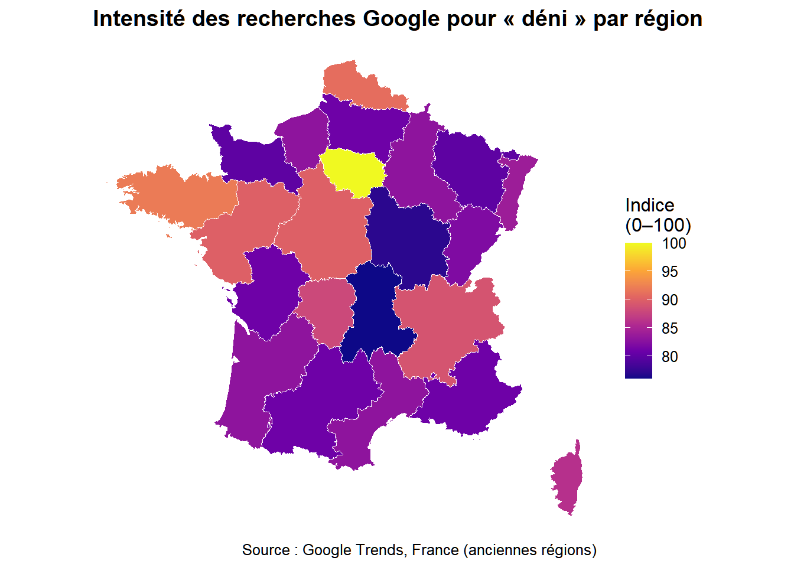

# Le discours du déni dans l’espace numérique français

Projet exploratoire de sociologie computationnelle analysant l’émergence et la diffusion du discours lié au déni en France.

## Contexte de recherche

Ce projet a été développé comme une première contribution de recherche au prochain ouvrage de Marc Joly consacré au déni dans le discours public français.

Il explore les dynamiques des expressions liées au déni à partir de :

* Données de séries temporelles issues de Google Trends ;
* Scraping exploratoire de publications Mastodon.

## Questions de recherche

* Comment l’usage du terme « déni » évolue-t-il dans le discours numérique français ?
* Certaines expressions, comme « déni de démocratie » ou « déni de justice », sont-elles associées à des événements politiques spécifiques ?
* Les traces numériques peuvent-elles éclairer l’émergence de stratégies discursives liées au déni ?

## Méthodes

* API Google Trends (`gtrendsR`) ;
* visualisation de séries temporelles ;
* scraping exploratoire de Mastodon ;
* workflow reproductible avec R et R Markdown.

## Exemples de résultats

### Intensité moyenne annuelle de « déni » - Introduction en page 20 de l'ouvrage

### Distribution géographique des recherches liées au déni

## Structure du dépôt

* `Deni.R` — script de collecte et d’analyse des données ;
* `Deni.Rmd` — document de recherche reproductible ;
* `Deni.html` — rapport d’analyse généré.

Le fichier `Deni.html` suffit pour consulter le travail et visualiser les résultats sans avoir à exécuter le code.

## Auteur

Gabriel Gallier
ENS Paris-Saclay — Master de sociologie quantitative et démographie
